<p align="center">
  <a href="https://boards.zeroclickdev.ai/">
    
  </a>
</p>

<p align="center">
  <a href="LICENSE"></a>
  <a href="https://github.com/tmcfarlane/zeroclickboards/stargazers"></a>
  <a href="https://github.com/tmcfarlane/zeroclickboards/issues"></a>
  <a href="https://boards.zeroclickdev.ai/"></a>
</p>

<p align="center">
  <a href="https://boards.zeroclickdev.ai/">Try It Live</a> - <a href="#features">Features</a> - <a href="#setup">Setup</a> - <a href="#deploy-to-vercel">Deploy</a> - <a href="#faq">FAQ</a> - <a href="#contributing">Contributing</a> - <a href="https://zeroclickdev.ai/">ZeroClickDev</a>
</p>

<p align="center">
  <a href="https://boards.zeroclickdev.ai/">
    
  </a>
</p>

<p align="center">
  <a href="https://boards.zeroclickdev.ai/">
    
  </a>
</p>

## ZeroBoards is an open-source, AI-powered Kanban board

**Describe your task. Let AI organize it.** ZeroBoards gives you a drag-and-drop Kanban board with an AI assistant that creates cards, moves tasks, and manages your workflow with plain-English commands.

- **AI assistant** — natural-language board control (5 free queries/day, Pro unlimited at $3/month)
- **Drag-and-drop** — smooth @dnd-kit interactions for cards and columns
- **Real-time sync** — changes flow instantly across tabs via Supabase Realtime
- **Timeline view** — Gantt-style planning for target dates
- **Open source & self-hostable** — MIT license, bring your own Supabase

---

> **We're past the era of reading docs.** Just paste this into your agent:
>
> > Read this and tell me why it's not just another Kanban clone: https://raw.githubusercontent.com/tmcfarlane/zeroclickboards/refs/heads/main/README.md

## Contents

- [Features](#features)
- [Quickstart](#quickstart)
- [Setup](#setup)
- [Architecture](#architecture)
- [Deploy to Vercel](#deploy-to-vercel)
- [FAQ](#faq)
- [Contributing](#contributing)
- [Built With](#built-with)
- [License](#license)

## Features

### Kanban Board

Drag-and-drop cards between columns and rearrange columns with smooth @dnd-kit interactions. Changes sync instantly across all open tabs via Supabase Realtime.

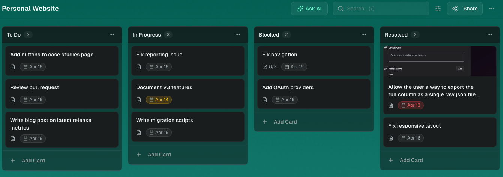

### AI Assistant

Tell it what to do in plain English — create cards, move tasks, organize your board. 5 free AI queries/day; unlimited with Pro ($3/month via Stripe).

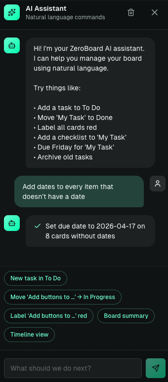

### Timeline View

Visualize card target dates on a Gantt-style timeline for project planning.

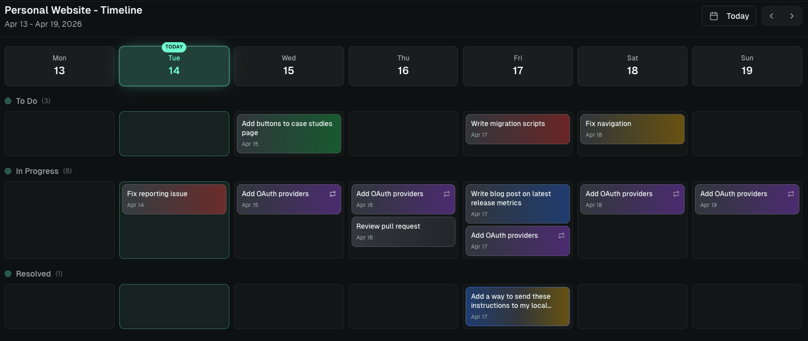

### Card Editor

Rich card editing with 6 label colors, cover images, checklists, and target dates. Archive cards to declutter, then restore or duplicate them anytime.

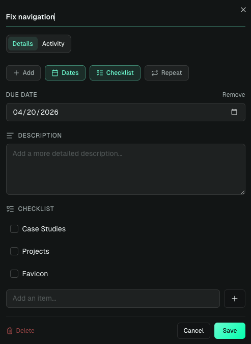

### Board Sharing

Share boards with collaborators via email — grant view or edit access and keep everyone in sync through Supabase Realtime.

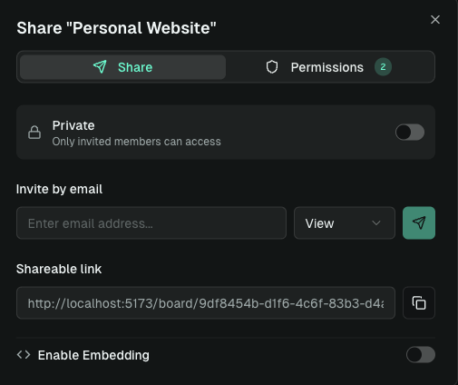

### Templates

Save any board as a reusable template, then spin up new boards from it in one click.

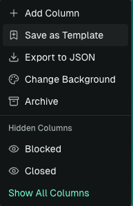

### Choose Background Color

Personalize each board with a gradient or solid color background — pick from curated presets or clear it to fall back to the default theme.

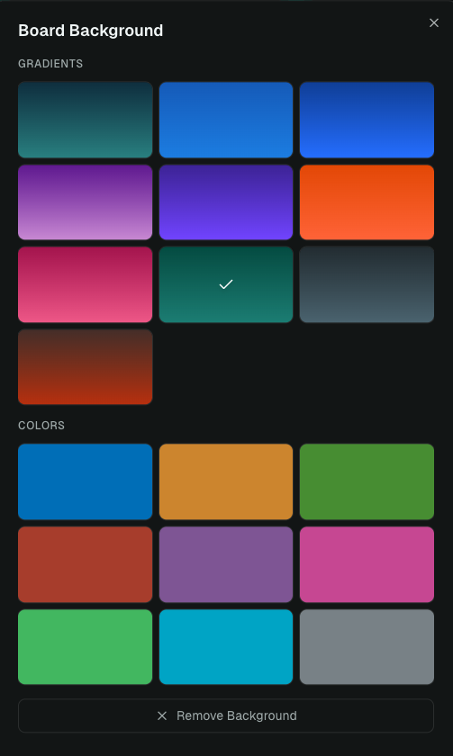

### Export to JSON

Export boards to JSON for backup, migration, or integration with other tools.

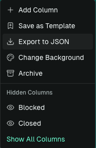

### Google OAuth + Email Auth

Sign in with Google or email/password via Supabase Auth — boards sync across devices the moment you log in.

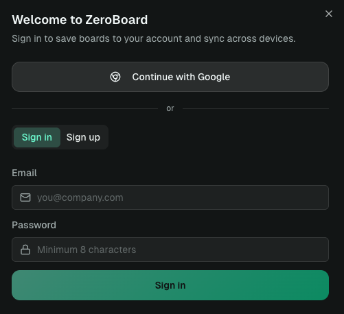

### Deploy with Vercel

One-click deploy straight from the GitHub repo — serverless API routes keep your Supabase and AI keys safe on the server.

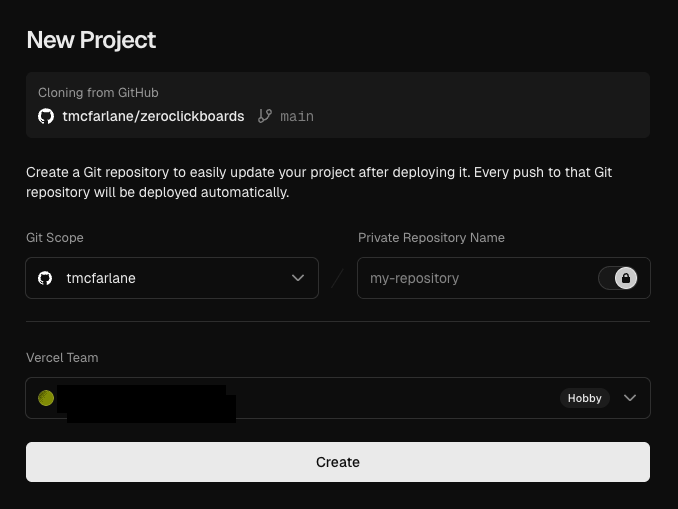

## Quickstart

```bash
# Prerequisites: Node.js 18+, npm
git clone https://github.com/tmcfarlane/zeroclickboards.git
cd zeroclickboards
npm install

npm run dev           # http://localhost:5173 (UI only)
vercel dev            # http://localhost:3000 (UI + API routes)
npm run build         # production build
```

## Setup

Setup is a mix of **agent-automatable** tasks (cloning the repo, `npm install`, scaffolding `.env.local`, running the dev server) and **dashboard-only** tasks that require you to click around Supabase, Google Cloud, and Stripe. An agent can't create your Supabase project or enable Google OAuth — but it can walk you through each click and start the app once you've filled in your own keys.

> **Keep your secrets out of the chat.** When the agent hands off a dashboard step, **you** should open `.env.local` and paste keys in yourself, then tell the agent you're done. Don't paste API keys, service-role keys, or webhook secrets into the agent conversation — they'd end up in logs, transcripts, and potentially the model provider's training data.

If your agent has the [**Supabase MCP**](https://github.com/supabase-community/supabase-mcp) server installed, it can go further — create the project and run migrations directly via MCP (keys stay in the MCP boundary, not the chat). Same idea with the [Stripe MCP](https://github.com/stripe/agent-toolkit). Without them, the dashboard steps and env-file edits are on you.

### For Humans

Copy and paste this prompt to your LLM agent (Claude Code, Cursor, Codex, AmpCode, etc.):

> Walk me through installing ZeroClickBoards using this guide:
> https://raw.githubusercontent.com/tmcfarlane/zeroclickboards/refs/heads/main/docs/guide/installation.md
>
> Do the automatable steps yourself (clone, install, scaffold `.env.local` with empty values, run the schema if you have Supabase MCP, start the dev server). For the dashboard-only steps (creating the Supabase project, enabling Google OAuth, setting up Stripe), pause and tell me exactly what to click and which env var each value maps to. **I'll paste the keys into `.env.local` myself and tell you when I'm done — don't ask me to share secrets in this chat.**

Or read the [Installation Guide](docs/guide/installation.md) and do it all yourself.

<details>
<summary><strong>For LLM Agents</strong> (click to expand — operating protocol for agents installing this repo)</summary>

&nbsp;

If you were invoked to install ZeroClickBoards, follow this protocol exactly. Don't skim — read it all before starting.

**1. Fetch the guide:**

```bash
curl -sL https://raw.githubusercontent.com/tmcfarlane/zeroclickboards/refs/heads/main/docs/guide/installation.md
```

**2. Probe your capabilities before starting.** Report to the user which of these you have; it changes what you can automate:

- Can you run shell commands? (for `git`, `npm`, `cp`, `curl`)
- Is the [Supabase MCP](https://github.com/supabase-community/supabase-mcp) connected? (lets you create the project + apply the schema)
- Is the [Stripe MCP](https://github.com/stripe/agent-toolkit) connected? (lets you create Products/Prices)
- Is the Vercel CLI installed? (for `vercel dev` / `vercel link`)

**3. Execute the guide top-to-bottom.** Each step is tagged `[automatable]`, `[dashboard]`, or `[MCP-automatable]`:

- `[automatable]` → run it yourself.
- `[MCP-automatable]` → run it via MCP if connected, otherwise treat as `[dashboard]`.
- `[dashboard]` → **stop**. Tell the user: (a) the exact dashboard URL/path, (b) what to click, (c) which env var each value maps to, (d) to reply when `.env.local` is updated. Then wait — do not proceed.

**4. Never request secrets in chat.** This is non-negotiable. Don't ask the user to paste API keys, anon keys, service-role keys, webhook secrets, OAuth client secrets, or Stripe keys into the conversation. Instruct them to edit `.env.local` directly. If you need to verify a value is set, check that the env var is non-empty — don't read or echo its contents.

**5. Scaffold, don't assume.** `cp .env.example .env.local` first, then let the user fill values. Never write placeholder secrets ("sk_test_xxx", "REPLACE_ME") into `.env.local` that the user might forget to replace — leave values empty so the app fails loudly on startup.

**6. Success criteria.** You are done when:

- `.env.local` exists with required keys filled in (verified by env-var presence check, not value inspection),
- the schema from `supabase/schema.sql` has been applied to the user's Supabase project,
- `npm run dev` or `vercel dev` starts without errors,
- the login page loads at the dev URL.

Report each criterion as checked or pending, then stop.

</details>

## Architecture

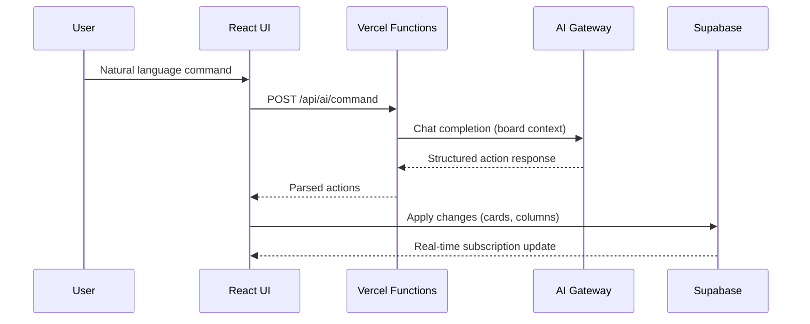

<details>
<summary><strong>Project layout</strong></summary>

| Path                                                       | Purpose                                   |
| ---------------------------------------------------------- | ----------------------------------------- |
| [`src/components/board/`](src/components/board)            | Kanban board, columns, cards, card editor |
| [`src/store/useBoardStore.ts`](src/store/useBoardStore.ts) | Zustand store for board state             |
| [`src/lib/database/`](src/lib/database)                    | Supabase query builders                   |
| [`src/lib/supabase.ts`](src/lib/supabase.ts)               | Supabase client                           |
| [`api/ai/command.ts`](api/ai/command.ts)                   | AI assistant endpoint                     |
| [`api/ai/usage.ts`](api/ai/usage.ts)                       | Daily usage limits                        |
| [`api/stripe/`](api/stripe)                                | Stripe checkout + webhooks                |
| [`supabase/schema.sql`](supabase/schema.sql)               | PostgreSQL schema + RLS policies          |

</details>

## Deploy to Vercel

[](https://vercel.com/new/clone?repository-url=https://github.com/tmcfarlane/zeroclickboards)

1. Import the repo in [Vercel](https://vercel.com/new)
2. Add the environment variables from [Setup](#2-environment-variables) in Project → Settings → Environment Variables
3. Deploy

`vercel.json` configures SPA rewrites while preserving `/api/*` routes.

> **Pricing note:** When you deploy your own instance, **you** pay for the AI usage your users generate (via your `AI_GATEWAY_API_KEY`). The app ships with a default pricing model to help you recoup those costs — 5 free AI queries/day per user (resets at midnight PT), and a Pro plan at $3/month for unlimited queries via Stripe. You're free to change the limits, price, currency, or remove paywalling entirely — edit [`api/ai/usage.ts`](api/ai/usage.ts) and your Stripe `STRIPE_PRICE_ID` to match whatever model you want (higher free tier, different price, one-time payment, fully free, etc.).

## FAQ

#### Is it really free?

Yes. The full app is MIT-licensed and self-hostable. On the hosted version, Pro ($3/month) unlocks unlimited AI queries — the free tier gives you 5 per day.

#### Do I need the AI assistant to use it?

No. ZeroClickBoards works as a regular Kanban board without any AI configuration. Skip the `AI_GATEWAY_*` variables if you don't want the AI assistant.

#### Can I self-host without Vercel?

Yes. The frontend is a static Vite build — any static host works. The `/api/*` serverless functions can run on any Node.js 18+ platform that supports the Vercel function signature (or can be trivially ported).

#### Where is my data stored?

In your own Supabase project. Row Level Security policies ensure users only see their own boards. See [`supabase/schema.sql`](supabase/schema.sql).

#### How do feature requests work?

Submit one via the [feedback page](https://boards.zeroclickdev.ai/feedback) or open a GitHub issue. Feedback submissions are auto-converted to GitHub issues, where an AI agent picks them up and opens a draft PR for human review. See [CONTRIBUTING.md](CONTRIBUTING.md).

## Contributing

Contributions are welcome! Whether it's a bug fix, a new feature, or just better docs — see [`CONTRIBUTING.md`](CONTRIBUTING.md) for the dev loop.

Security issues: please report privately via [`SECURITY.md`](SECURITY.md) (if present) or email the maintainer.

## Built With


Built with AI assistance using [Claude Code](https://claude.ai/claude-code) and [Oh My ClaudeCode](https://github.com/yeachan-heo/oh-my-claudecode).

## Star History

[](https://www.star-history.com/#tmcfarlane/zeroclickboards&type=date&legend=top-left)

## License

MIT. See [`LICENSE`](LICENSE) — _build something great with it._
