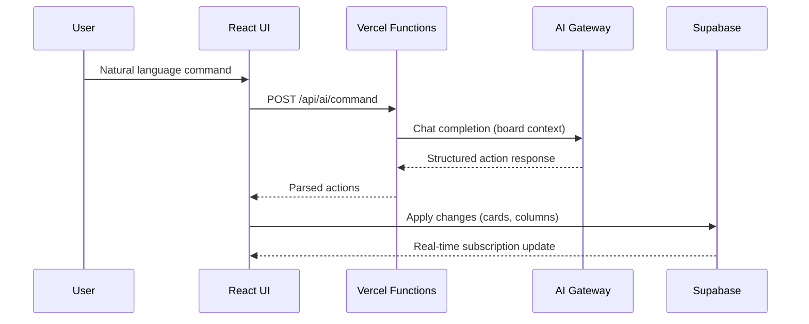

<div align="center">

<p>
  <a href="https://boards.zeroclickdev.ai/">
    
  </a>
</p>

<div style="font-size: 2.5em; font-weight: 800; letter-spacing: 0.08em; line-height: 1.1;">
  <strong>ZEROCLICKBOARDS</strong>
</div>

<div style="font-size: 1.1em; margin: 8px 0;">
  <strong>Describe your task. Let AI organize it.</strong>
</div>

The open-source Kanban board with an AI assistant that creates cards, moves tasks, and manages your workflow with plain-English commands.<br>
AI assistant &nbsp;|&nbsp; Drag-and-drop &nbsp;|&nbsp; Real-time sync &nbsp;|&nbsp; Timeline view &nbsp;|&nbsp; Dark cyberpunk theme

<br>

[](https://boards.zeroclickdev.ai/)

[](LICENSE)
[](https://github.com/tmcfarlane/zeroclickboards/stargazers)
[](https://github.com/tmcfarlane/zeroclickboards/issues)
[](https://boards.zeroclickdev.ai/)
<br>

Created by <a href="https://zeroclickdev.ai/">ZeroClickDev</a>

</div>

---

## Contents

- [Features](#features)
- [Quickstart](#quickstart)
- [Setup](#setup)
- [Architecture](#architecture)
- [Deploy to Vercel](#deploy-to-vercel)
- [Tech Stack](#tech-stack)
- [FAQ](#faq)
- [Contributing](#contributing)
- [Built With](#built-with)
- [License](#license)

## Features

### Kanban Board

Drag-and-drop cards between columns and rearrange columns with smooth @dnd-kit interactions. Changes sync instantly across all open tabs via Supabase Realtime.


### AI Assistant

Tell it what to do in plain English — create cards, move tasks, organize your board. 5 free AI queries/day; unlimited with Pro ($3/month via Stripe).


### Timeline View

Visualize card target dates on a Gantt-style timeline for project planning.


### Card Editor

Rich card editing with 6 label colors, cover images, checklists, and target dates. Archive cards to declutter, then restore or duplicate them anytime.


### Also included

- **Dark cyberpunk theme** — charcoal UI with cyan accents, built for late-night productivity
- **Google OAuth + email auth** — sign in with Google or email/password via Supabase Auth
- **Deploy anywhere** — one-click Vercel deploy, serverless API keeps credentials safe

## Quickstart

```bash
# Prerequisites: Node.js 18+, npm
git clone https://github.com/tmcfarlane/zeroclickboards.git
cd zeroclickboards
npm install

npm run dev           # http://localhost:5173 (UI only)
vercel dev            # http://localhost:3000 (UI + API routes)
npm run build         # production build
```

## Setup

### 1. Supabase

Create a [Supabase](https://supabase.com) project, then run [`supabase/schema.sql`](supabase/schema.sql) in the SQL Editor.

In Supabase → Authentication:
- Enable **Email / Password**
- Enable **Google** provider
- Add redirect URLs: `http://localhost:5173` and your production URL

### 2. Environment variables

```bash
cp .env.example .env.local
```

| Variable | Scope | Description |
| --- | --- | --- |
| `VITE_SUPABASE_URL` | Client | Supabase project URL |
| `VITE_SUPABASE_ANON_KEY` | Client | Supabase anon/public key |
| `SUPABASE_SERVICE_ROLE_KEY` | Server | Service role key for API routes |
| `AI_GATEWAY_API_KEY` | Server | AI provider API key |
| `AI_GATEWAY_MODEL` | Server | Model name (e.g. `gpt-4o`) |
| `STRIPE_SECRET_KEY` | Server | Stripe secret key (payments) |
| `STRIPE_PRICE_ID` | Server | Stripe price ID for Pro plan |
| `STRIPE_WEBHOOK_SECRET` | Server | Stripe webhook signing secret |
| `VITE_GITHUB_REPO_URL` | Client | Optional — shows GitHub link in header |

> **Never prefix sensitive keys with `VITE_`** — any `VITE_*` variable is exposed to the browser.

### 3. Stripe webhooks (local development)

```bash
# Install: brew install stripe/stripe-cli/stripe
stripe login
stripe listen --forward-to localhost:3000/api/stripe/webhook
```

Add the printed `whsec_...` secret to `.env.local` as `STRIPE_WEBHOOK_SECRET`.

## Architecture



<details>
<summary><strong>Project layout</strong></summary>

| Path | Purpose |
| --- | --- |
| [`src/components/board/`](src/components/board) | Kanban board, columns, cards, card editor |
| [`src/store/useBoardStore.ts`](src/store/useBoardStore.ts) | Zustand store for board state |
| [`src/lib/database/`](src/lib/database) | Supabase query builders |
| [`src/lib/supabase.ts`](src/lib/supabase.ts) | Supabase client |
| [`api/ai/command.ts`](api/ai/command.ts) | AI assistant endpoint |
| [`api/ai/usage.ts`](api/ai/usage.ts) | Daily usage limits |
| [`api/stripe/`](api/stripe) | Stripe checkout + webhooks |
| [`supabase/schema.sql`](supabase/schema.sql) | PostgreSQL schema + RLS policies |

</details>

## Deploy to Vercel

[](https://vercel.com/new/clone?repository-url=https://github.com/tmcfarlane/zeroclickboards)

1. Import the repo in [Vercel](https://vercel.com/new)
2. Add the environment variables from [Setup](#2-environment-variables) in Project → Settings → Environment Variables
3. Deploy

`vercel.json` configures SPA rewrites while preserving `/api/*` routes.

> **Pricing note:** Free users get 5 AI queries/day (resets at midnight PT). Pro subscribers ($3/month) get unlimited.

## Tech Stack


## FAQ

#### Is it really free?

Yes. The full app is MIT-licensed and self-hostable. On the hosted version, Pro ($3/month) unlocks unlimited AI queries — the free tier gives you 5 per day.

#### Do I need the AI assistant to use it?

No. ZeroClickBoards works as a regular Kanban board without any AI configuration. Skip the `AI_GATEWAY_*` variables if you don't want the AI assistant.

#### Can I self-host without Vercel?

Yes. The frontend is a static Vite build — any static host works. The `/api/*` serverless functions can run on any Node.js 18+ platform that supports the Vercel function signature (or can be trivially ported).

#### Where is my data stored?

In your own Supabase project. Row Level Security policies ensure users only see their own boards. See [`supabase/schema.sql`](supabase/schema.sql).

#### How do feature requests work?

Submit one via the [feedback page](https://boards.zeroclickdev.ai/feedback) or open a GitHub issue. Feedback submissions are auto-converted to GitHub issues, where an AI agent picks them up and opens a draft PR for human review. See [CONTRIBUTING.md](CONTRIBUTING.md).

## Contributing

Contributions are welcome! Whether it's a bug fix, a new feature, or just better docs — see [`CONTRIBUTING.md`](CONTRIBUTING.md) for the dev loop.

Security issues: please report privately via [`SECURITY.md`](SECURITY.md) (if present) or email the maintainer.

## Built With

Built 100% with AI assistance using [Claude Code](https://claude.ai/claude-code) and [Oh My ClaudeCode](https://github.com/nicobailon/oh-my-claudecode).

## Star History

[](https://www.star-history.com/#tmcfarlane/zeroclickboards&type=date&legend=top-left)

## License

MIT. See [`LICENSE`](LICENSE) — _build something great with it._
