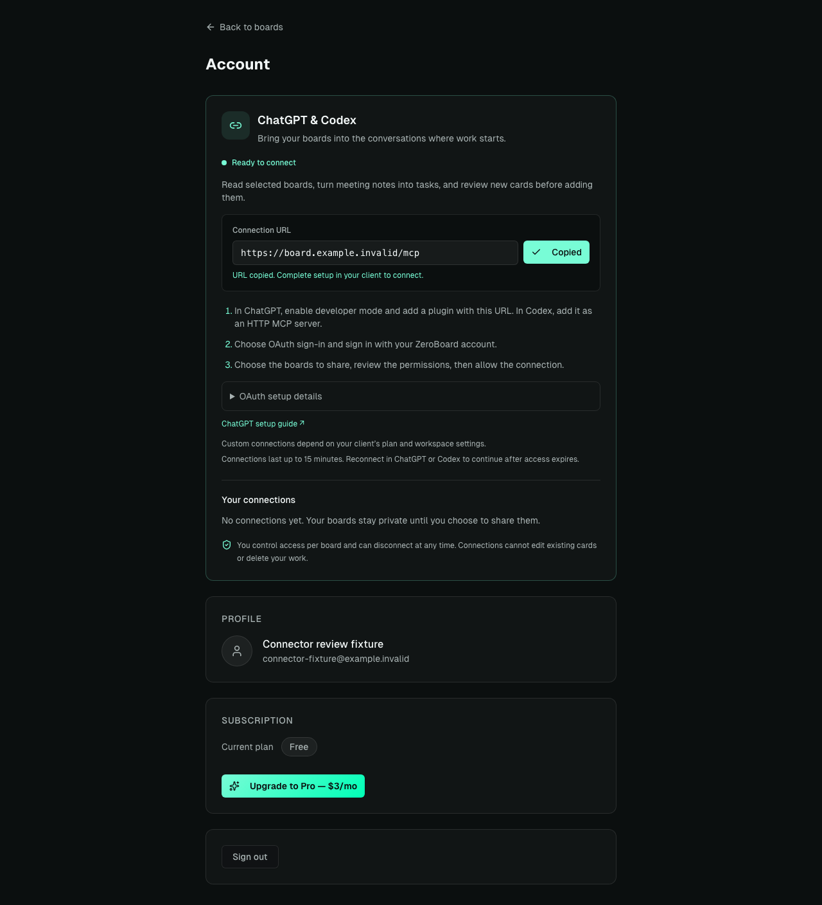
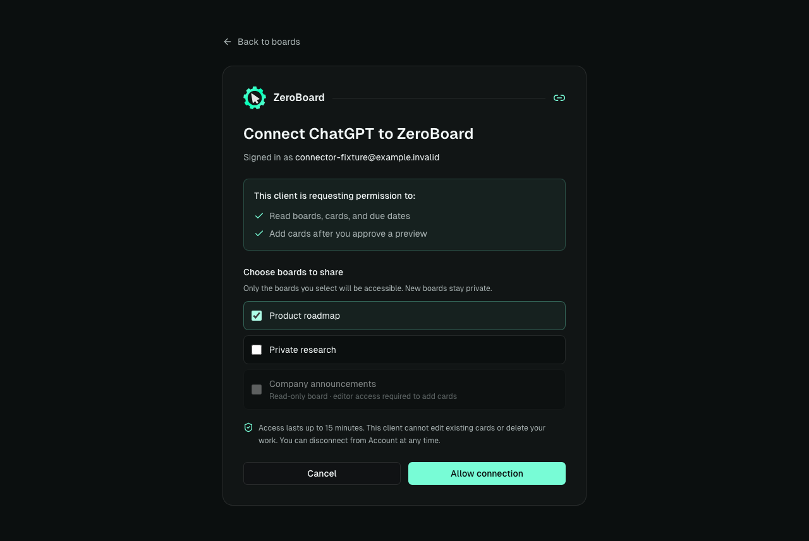
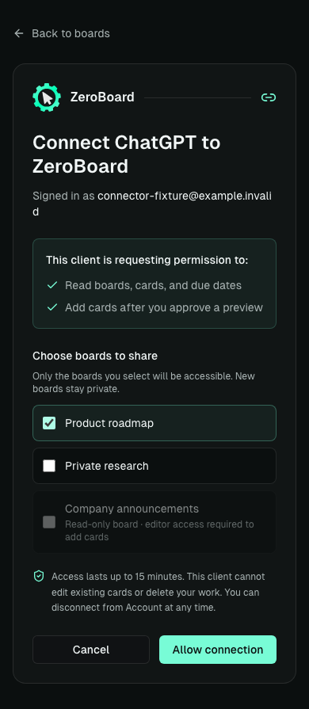

# ChatGPT and Codex connection UI

Open the account menu on `/app` and choose **ChatGPT & Codex**. The account page shows the connection URL, setup guidance, the service's actual availability, selected-board grants, expiry, and a disconnect control. Copying a URL does not grant access.

A client begins OAuth at `/authorize`. ZeroBoard's `/auth/connector` page keeps the pending request through the existing sign-in flow, displays the requesting client and permissions, and starts with no boards selected. Read-only boards cannot be selected for a request that can add cards. Allow checks membership and edit access again on the server; Cancel consumes the pending request without issuing credentials.

The Vercel adapter routes discovery, authorization, token exchange, revocation, and stateless MCP requests to the existing hosted core. Connection management uses the current authenticated ZeroBoard account. The encrypted private session vault stores only a validated access token, expires within 15 minutes or sooner with the account token, and never rotates or stores a browser refresh token. Disconnect revokes the grant and removes its vault entry. Existing board membership and the selected-board grant are rechecked for tool access.

## Verification

```sh
npm test
npm run lint
npm run build
npm test --prefix mcp-server
npx playwright test --config playwright.connector.config.ts
```

The standalone browser suite renders the actual application with disposable HTTP fixtures, including Supabase authentication responses. It covers account-menu navigation, copy/manual copy, explicit board selection, approval, cancellation, read-only access, disconnect confirmation, failures, signed-out consent, and desktop/mobile layout. It does not modify a production account or real board. Backend tests separately exercise the real OAuth and HTTP handlers, persistence, session vault encryption, and authorization failure paths.

Verified locally: 658 app/API tests, 136 MCP tests, and 34 desktop/mobile browser cases. Lint and the production build pass. A fresh root-only `npm ci` without nested MCP dependencies also passes the backend tests and production build, matching Vercel's install layout.

## Screenshot evidence

Screenshots in `docs/screenshots/chatgpt-ui/` come from the browser suite's disposable fixtures. They show the implemented UI, not an already provisioned production connection or a completed ChatGPT directory installation.

Account setup:



Selected-board consent:



Mobile consent:



Also captured: [mobile setup](screenshots/chatgpt-ui/setup-mobile.png) and [disconnect confirmation](screenshots/chatgpt-ui/disconnect-confirmation-desktop.png).

## Deployment requirements

This PR provides the UI and runtime adapter; production enablement still requires the private SQL migrations, a dedicated database login with the connector privilege role, stable server secrets, and the exact public OAuth clients/callbacks from connection setup. See [`mcp-server/HOSTED.md`](../mcp-server/HOSTED.md) and [`.env.example`](../.env.example). Keep the connector disabled until those prerequisites are complete. The UI reports an unavailable service when configuration or private database access is missing.

ChatGPT's current connection setup is documented in [OpenAI's connection guide](https://developers.openai.com/plugins/deploy/connect-chatgpt). Configure exact callbacks according to [OpenAI's OAuth requirements](https://developers.openai.com/plugins/build/auth). Directory publication, Sign in with ChatGPT, and ChatGPT-plan-funded inference are separate capabilities.
