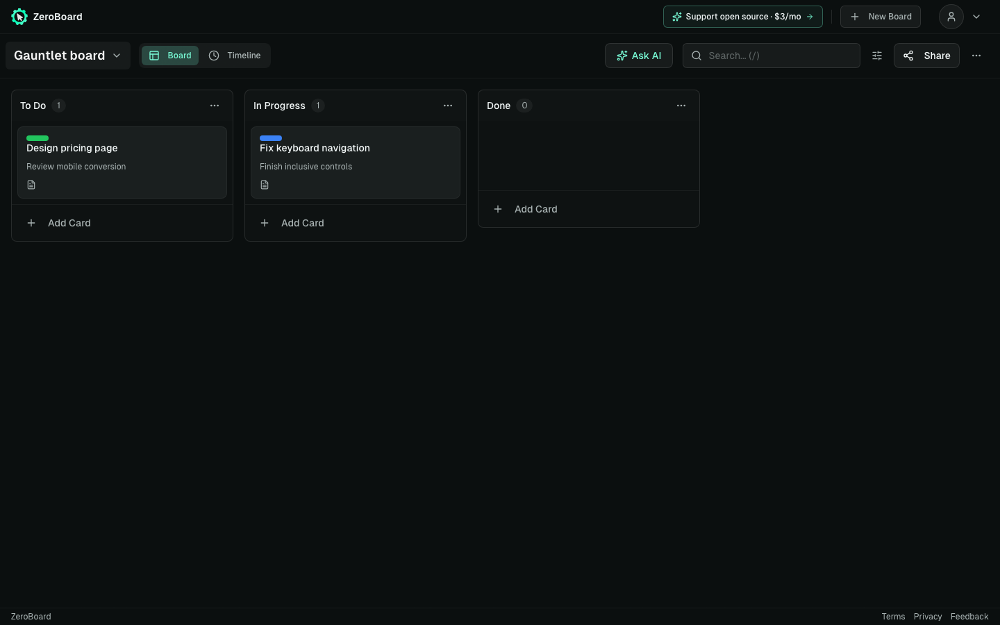
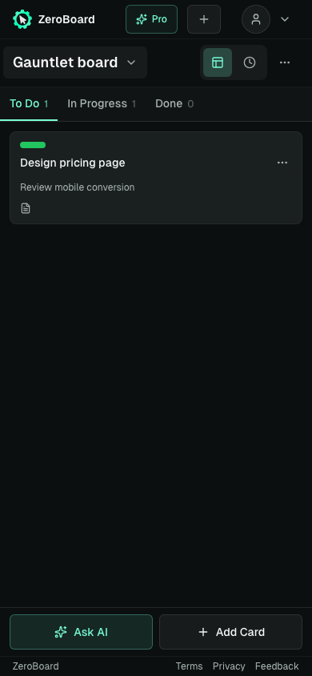

# Website and MCP repair verification

The first audit batch repairs observed failures in keyboard/card creation, touch controls, connector response handling, OAuth callbacks, and local MCP startup/session handling.

## Reproductions and changes

- `N` had no card-creation callback; real uppercase `Shift+N` was ignored. Card creation now retains its selected board/column through save. Shortcuts ignore active menus, dialogs, composed input, and already-handled events.
- Touch tablets hid action buttons behind hover-only styling. Touch actions remain visible; keyboard focus reveals desktop actions. Icon controls now have names and filters/view toggles expose their selected state. Card action templates read current card data.
- Malformed HTTP 200 connector payloads could crash settings, treat a string as write permission, or dismiss a failed revocation. Operation-specific validation rejects them and keeps the recovery UI. Inherited object keys are not recognized as routes or permissions.
- OAuth callbacks now include the exact discovery issuer on approval, cancellation, and protocol errors, preserving state as required by RFC 9207. Unregistered callbacks remain rejected before redirect.
- Unknown MCP serve flags fail before reading account credentials. Large Unicode previews fail with a split-batch message before returning an unusable commit token. Invalid/oversized MCP JSON receives safe protocol errors.
- Local login/server startup rejects privileged Supabase keys. Credential rewrites tighten file permissions; saved sessions with project metadata are not sent to another configured project. Package documentation distinguishes the repository build from the older npm release.

## Database deployment

The deployed board UPDATE policy used the all-member helper, allowing viewer/commenter members to change content and access fields. The existing, previously merged editor-enforcement migration was applied unchanged after production schema/policy preflight and isolated PostgreSQL before/after verification. Live catalog verification confirms the owner/editor policy and access guard, with the timestamp trigger preserved. No board rows were changed by the deployment. Unrelated shared-project advisor findings were unchanged.

The PostgreSQL fixture now mirrors the actual policy/helper/trigger definitions and verifies member/public/embed reads, owner/editor saves, timestamp updates, denied viewer/commenter/anonymous writes, sharing/ownership guards, and the effect of additional permissive policies.

## Checks

- 692 app/API unit tests passed with two workers. The initial concurrent build/browser/test run hit four default-timeout failures; the isolated full rerun passed without timeout or assertion changes.
- 155 MCP tests passed, including actual HTTP transport, SQL, isolated HOME/process, and package checks.
- 54 disposable desktop/mobile/tablet browser cases passed.
- Full lint, TypeScript, production build, and diff checks passed.

All browser mutations used disposable fixtures. Production account-page inspection was read-only. Hosted connection configuration remains a separate deployment requirement.

Fixture views after the repairs:

## Shared access and native OAuth follow-up

Shared-board access is tracked separately from board content. Viewer/commenter boards use a searchable read-only presentation; ownership controls sharing/deletion, and editors retain content controls. Pending card drafts survive a downgrade, while queued saves, undo/redo, archive actions, activity writes, and delayed AI commands recheck current access. Shared writes refresh membership before saving because production publishes board changes but not membership changes. Focus also refreshes membership; this is not an instantaneous membership push guarantee.

The slash shortcut switches timeline to the board and focuses the visible desktop or mobile search. Hidden-column and empty-board recovery remains available after reload. Keyboard users can reach board rename/delete submenus, and card creation consistently opens the full editor for the selected column.

Native Codex OAuth accepts only literal HTTP `127.0.0.1` callbacks with a valid port. The registered path/query remain fixed, HTTPS callbacks remain exact, and token exchange must match the actual stored callback including its port. HTTP preflight rejects unsafe callbacks before the SDK can redirect. Consent approval and cancellation share the same validation.

A production ACL audit found that unrelated SQL logins inherited public access to privileged invite and trigger helpers. The reviewed ACL-only migration removes this inherited execution, restricts the browser invite wrapper to the authenticated role, and retains trusted service/owner paths. It was applied and its live function ACLs verified; existing signup and settings triggers remain enabled. PostgreSQL regression tests reproduce the prior invite/temporary-trigger paths and verify intended signup, settings, RLS, and browser invite behavior after applying the repair twice.

Follow-up validation: 730 app/API tests, 164 MCP tests, and 82 disposable desktop/mobile browser checks passed. Full lint, TypeScript, build, and diff checks passed. A concurrent app/browser run hit three default-timeout failures; the isolated app rerun passed without assertion or timeout changes. Hosted runtime credentials and real client linking remain a separate deployment step.

Remaining draft-retention work includes board/column text dialogs and an open share dialog when ownership falls to viewer access; content writes are blocked, but those presentation switches can still dismiss local text.
