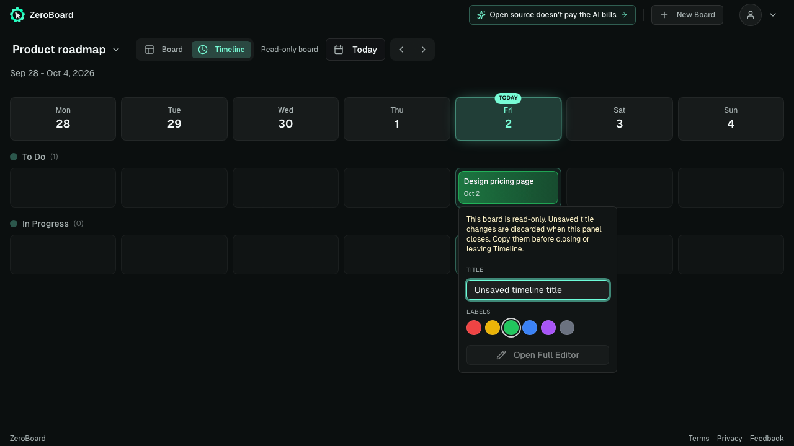
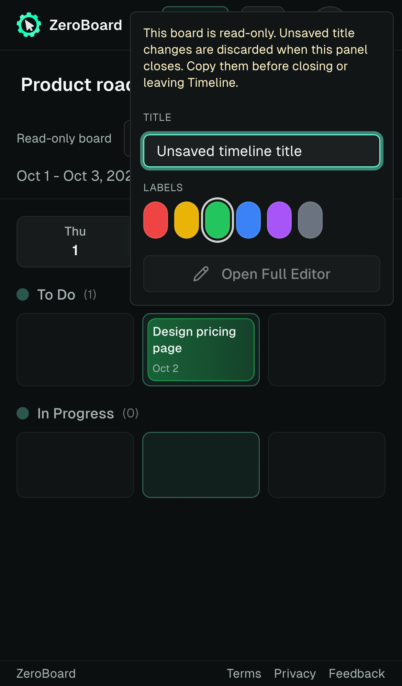

# Timeline title lifetime and card accessibility

A read-only Timeline title field keeps the unsaved text available for copying while its panel is open. Closing the panel discards that text. The warning now states this lifetime explicitly. Read-only and recurring Timeline cards remain operable view/edit buttons when dragging is disabled; they no longer inherit a disabled drag button state.

## Actual compiled fixture screenshots

These disposable desktop/mobile fixtures show the retained unsaved title, the copy-before-close warning, and disabled editing controls. They are rendered from the compiled working Vite bundle, using fixture auth and board requests. They do not show a production or human account.

| Desktop | Mobile |
| --- | --- |
|  |  |

## Verification

The final narrow browser gate passed all eight executions with one worker and zero retries: the existing two IME cases, recurring card keyboard activation/full editor, and editor-to-viewer downgrade with copyable text and close/reopen behavior, on desktop and mobile. Normal Enter retains its exact-one-write control; denied edits and card activation send no writes. The working build and scoped lint passed.

The initial six-case compiled gate passed four and failed two because disabled drag attributes incorrectly marked the operable read-only card disabled. That failure is preserved. Excluding those drag attributes from non-draggable cards passed all six, then the additional recurring control brought the final gate to eight passes. The copy correction does not add durable title retention or shell navigation protection.

[verification.json](verification.json) records the source, 41 compiled artifact, harness, screenshot dimension, and log hashes. The harness snapshots record task-local paths and private output directories; they document the executed build, rather than serving as portable repository configuration. Full CI must pass the final PR head before merge.
